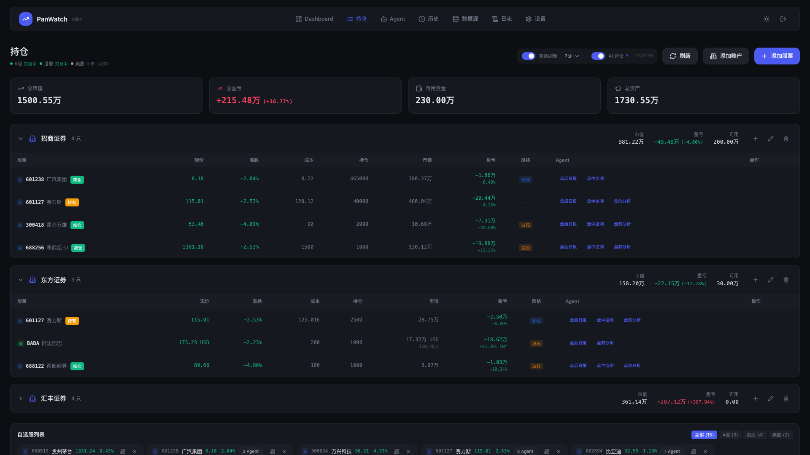
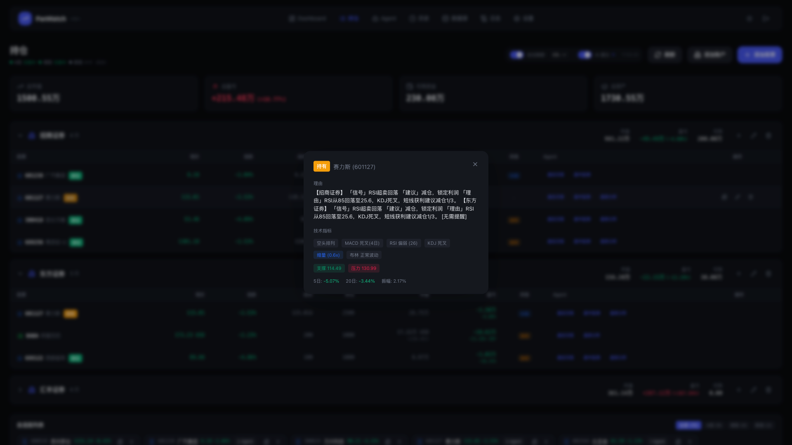

# 盯盘侠 PanWatch

**私有部署的 AI 股票助手** — 实时行情监控、智能技术分析、多账户持仓管理

[](LICENSE)
[](https://hub.docker.com/r/sunxiao0721/panwatch)


| 持仓管理 | AI 建议 |
|:---:|:---:|
|  |  |

<details>
<summary>移动端截图</summary>


</details>

## 为什么选择盯盘侠？

- **数据私有** — 自托管部署，持仓数据不经过任何第三方
- **AI 原生** — 不是简单的指标堆砌，而是让 AI 理解你的持仓、风格和目标
- **开箱即用** — Docker 一键部署，5 分钟完成配置

## 核心功能

<details>
<summary><b>智能 Agent 系统</b></summary>

| Agent | 触发时机 | 功能 |
|-------|---------|------|
| **盘前分析** | 每日开盘前 | 综合隔夜美股、新闻消息、技术形态，给出今日操作策略 |
| **盘中监测** | 交易时段实时 | 监控异动信号，RSI/KDJ/MACD 共振时推送提醒 |
| **盘后日报** | 每日收盘后 | 复盘当日走势，分析资金流向，规划次日操作 |
| **新闻速递** | 定时采集 | 抓取财经新闻，AI 筛选与持仓相关的重要信息 |

</details>

<details>
<summary><b>专业技术分析</b></summary>

- **趋势指标**：MA 多空排列、MACD 金叉死叉、布林带突破
- **动量指标**：RSI 超买超卖、KDJ 钝化与背离
- **量价分析**：量比异动、缩量回调、放量突破
- **形态识别**：锤子线、吞没形态、十字星等 K 线形态
- **支撑压力**：自动计算多级支撑位和压力位

</details>

<details>
<summary><b>多市场 & 多账户</b></summary>

- **覆盖市场**：A 股、港股、美股实时行情
- **账户管理**：支持多券商账户独立管理，汇总展示总资产
- **交易风格**：按短线/波段/长线分别设置，AI 建议更精准

</details>

<details>
<summary><b>全渠道通知</b></summary>

Telegram / 企业微信 / 钉钉 / 飞书 / Bark / 自定义 Webhook

</details>

## 快速开始

```bash
docker run -d \
  --name panwatch \
  -p 8000:8000 \
  -v panwatch_data:/app/data \
  sunxiao0721/panwatch:latest
```

访问 `http://localhost:8000`，首次使用设置账号密码即可。

<details>
<summary>Docker Compose</summary>

```yaml
version: '3.8'
services:
  panwatch:
    image: sunxiao0721/panwatch:latest
    container_name: panwatch
    ports:
      - "8000:8000"
    volumes:
      - panwatch_data:/app/data
    restart: unless-stopped

volumes:
  panwatch_data:
```

```bash
docker-compose up -d
```

</details>

<details>
<summary>环境变量</summary>

| 变量名 | 说明 | 默认值 |
|--------|------|--------|
| `AUTH_USERNAME` | 预设登录用户名 | 首次访问时设置 |
| `AUTH_PASSWORD` | 预设登录密码 | 首次访问时设置 |
| `JWT_SECRET` | JWT 签名密钥 | 自动生成 |
| `DATA_DIR` | 数据存储目录 | `./data` |

</details>

<details>
<summary>首次配置</summary>

1. 访问 Web 界面，设置登录账号
2. **设置 → AI 服务商**：配置 OpenAI 兼容 API（支持 OpenAI / 智谱 / DeepSeek / Ollama 等）
3. **设置 → 通知渠道**：添加 Telegram 或其他推送渠道
4. **持仓 → 添加股票**：添加自选股，启用对应 Agent

</details>

<details>
<summary>本地开发</summary>

**环境要求**：Python 3.10+ / Node.js 18+ / pnpm

```bash
# 后端
python -m venv venv && source venv/bin/activate
pip install -r requirements.txt
python server.py

# 前端（新终端）
cd frontend && pnpm install && pnpm dev
```

前端运行在 `http://localhost:5173`，自动代理 API 到后端。

</details>

## 技术栈

**后端**：FastAPI / SQLAlchemy / APScheduler / OpenAI SDK

**前端**：React 18 / TypeScript / Tailwind CSS / shadcn/ui

## 贡献

欢迎提交 Issue 和 PR！自定义 Agent 和数据源开发请参考 [贡献指南](CONTRIBUTING.md)。

## License

[MIT](LICENSE)
